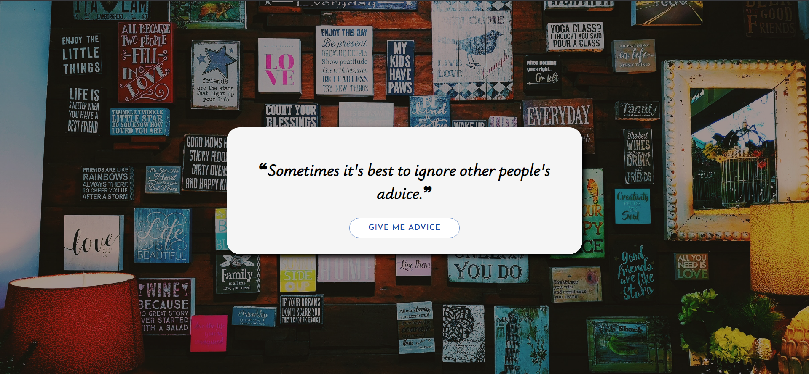

# Random Quote Generator - React

A web application built with React.js that displays random quotes fetched from the adviceslipjsonapi.

## Features

- Generate Random Quotes: Get inspirational and thought-provoking quotes with a click of a button.
- Responsive Design: Enjoy a seamless user experience on different devices and screen sizes.

## Technologies Used
- React.js
- CSS
- adviceslipjsonapi

# Usage
- Click the "Generate Quote" button to display a new random quote.
- Use the social media icons to share the current quote on various platforms.

# API Usage
The project utilizes the adviceslipjsonapi to fetch random quotes. 

## Screenshots

